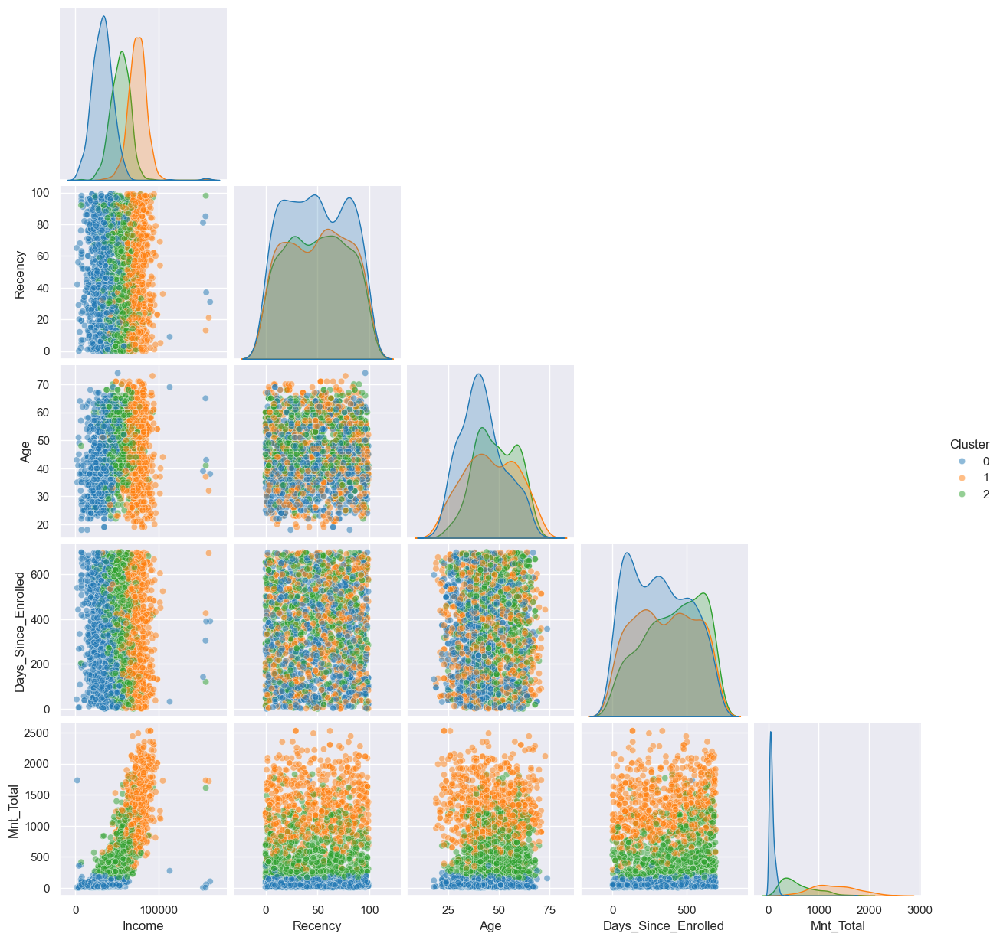
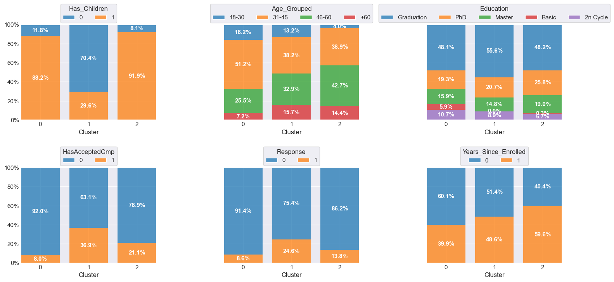
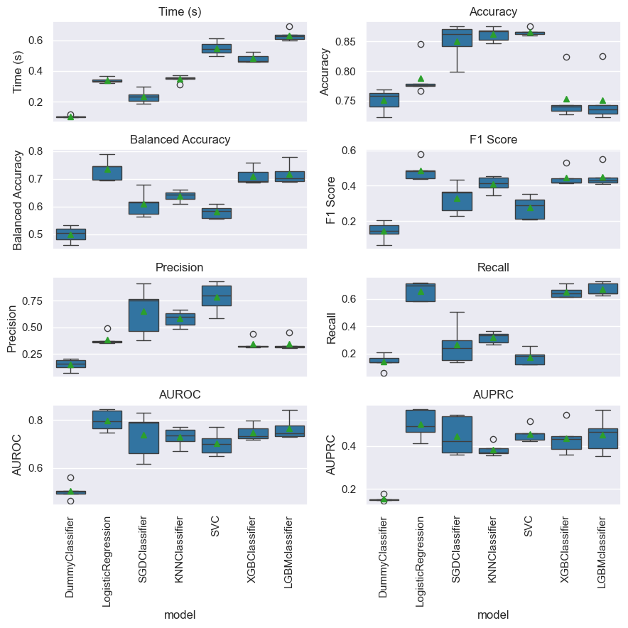

# Case iFood - Analista de dados

pt-br

Considere uma empresa bem estabelecida que atua no setor de varejo de alimentos. Atualmente, eles têm cerca de vários milhares de clientes registrados e atendem quase um milhão de consumidores por ano. Eles vendem produtos de 5 grandes categorias: vinhos, carnes, frutas exóticas, peixes especialmente preparados e produtos doces. Estes podem ser divididos ainda mais em produtos de *gold* e regulares. Os clientes podem encomendar e adquirir produtos por meio de 3 canais de vendas: lojas físicas, catálogos e site da empresa. Globalmente, a empresa teve receitas sólidas e uma linha de fundo saudável nos últimos 3 anos, mas as perspectivas de crescimento dos lucros para os próximos 3 anos não são promissoras... Por esse motivo, várias iniciativas estratégicas estão sendo consideradas para inverter essa situação. Um deles é melhorar o desempenho das atividades de marketing, com foco especial em campanhas de marketing.



Projeto estudo de caso baseado no processo seletivo para Analista de Dados do iFood disponível [neste repositório](https://github.com/ifood/ifood-data-business-analyst-test).

Descrição completa do case [aqui](related/ifood_crm_data_analyst_case.md).

## Objetivos

Através do estudo de caso do processo seletivo do Ifood foi  possível:
- Construir uma análise exploratória robusta.
- Segmentar os clientes da base de dados fornecida.
- Construir um modelo de classificação para prever se um cliente irá comprar o produto oferecido na campanha.
- Apresentar uma estrutura de projeto de Ciência de Dados, com a utilização de notebooks, scripts, relatórios e repositório no GitHub.
- Apresentar boas práticas de programação em Python, como a utilização de funções e arquivos de script para facilitar o reaproveitamento de código.
- Mostrar boas práticas de uso do SciKit-Learn, como a utilização de pipelines e otimização de hiperparâmetros.

## Detalhes do dataset utilizado e resumo dos resultados

Um dicionário de dados está disponível: [aqui](related/dicionario_dados.md).
Descrição completa [aqui](related/ifood_crm_data_analyst_case.md).

Com um pipeline com pré-processamento, PCA e K-Means, a base foi segmentada em 3 clusters:


Análise por cluster:

- Cluster 0:

  - Menor renda  
  - menor gasto 
  - maior probabilidade de ter filhos (jovens)
  - baixa propensão a aceitar campanhas
  - único cluster com porcentagem significativa de pessoas com escolaridade básica
  - grupo com pessoas mais jovens
  

- Cluster 1: 
 
  - Renda alta 
  - gasto alto 
  - menor probabilidade de ter filhos
  - mais propenso a aceitar campanhas
  - cluster sem pessoas com escolaridade básica
  - mais pessoas com idade intermediária/elevada
  

- Cluster 2: 
  - Renda intermediária
  - gasto intermediário
  - maior probabilidade de ter filhos (adolescentes)
  - pode aceitar campanhas
  - mais pessoas com idade intermediária/elevada



## Conclusões

### 📊 Insights Estratégicos com Base na Segmentação de Clientes
A combinação da análise exploratória com a segmentação por clusters revela três perfis distintos de clientes, permitindo à empresa adotar estratégias de marketing mais direcionadas e eficientes.

🧩 Cluster 0 – Clientes com Menor Potencial de Consumo
Este grupo é formado por clientes com menor renda, baixo nível de gastos e maior presença de filhos jovens. É o único segmento com participação significativa de pessoas com formação básica e concentra clientes mais jovens. Eles demonstram baixa propensão a responder às campanhas promocionais.

🔹 Oportunidade: Estratégias de fidelização de longo prazo, ofertas mais acessíveis e campanhas educativas podem ser eficazes aqui, além de ações que incentivem o primeiro engajamento com a marca.

💎 Cluster 1 – Clientes com Maior Potencial de Valor
Clientes desse grupo apresentam alta renda, maior volume de gastos, e raramente têm filhos. São os mais propensos a aceitar campanhas, com maior concentração de pessoas com nível educacional mais elevado e em faixa etária mais madura.

🔹 Oportunidade: Esse segmento é ideal para ofertas premium, programas de fidelidade e campanhas personalizadas. Representa um público estratégico, com grande potencial de conversão e geração de receita.

⚖️ Cluster 2 – Clientes com Potencial Moderado
O terceiro grupo apresenta renda e gastos intermediários, e maior presença de filhos adolescentes. A aceitação de campanhas é possível, ainda que não tão expressiva quanto no Cluster 1. Também é formado por clientes com idade intermediária ou elevada.

🔹 Oportunidade: Estratégias híbridas podem ser adotadas, com foco em identificar gatilhos de engajamento que aumentem o envolvimento desse grupo com as campanhas. Incentivos moderados e segmentação por ciclo de vida familiar podem ser úteis.

### 🎯 Direcionamento Estratégico
Essa segmentação permite que a empresa:

Personalize campanhas conforme o perfil do cliente.

Otimize o uso de recursos, focando esforços nos públicos com maior retorno esperado.

Aumente a conversão e fidelização, criando ações adequadas à realidade e ao comportamento de cada grupo.

Essa abordagem orientada por dados permite entender melhor o público, falar a língua de cada perfil e entregar mais valor ao cliente — transformando dados em decisões mais inteligentes para o negócio.


## Classificação

Posteriormente, seis modelos de classificação com diferentes abordagens e complexidades foram treinados para comparar desempenho e entender o comportamento em relação a classificação dos clientes.  A ideia é avaliar desde modelos base simples até modelos avançados com capacidade de ajuste fino e desempenho elevado em bases reais.


1. LogisticRegression – Modelo Linear Interpretable 

    * É simples, eficiente e rápido, especialmente em datasets com número razoável de features.

    * Interpretação direta dos coeficientes ajuda na explicação do modelo.

    * Funciona bem quando a relação entre as variáveis é aproximadamente linear.

    * Ponto de atenção: Pode não capturar relações não lineares nos dados.

2. SGDClassifier – Gradiente Estocástico (versátil e eficiente)

    * Muito eficiente em grandes volumes de dados.

    * Permite usar diferentes funções de perda (log loss, hinge, etc.).

    * Suporta regularizações L1, L2 e ElasticNet.

    * Ponto de atenção: Sensível a hiperparâmetros como taxa de aprendizado e número de iterações.

3. KNeighborsClassifier – Baseado em Instância

    * Simples e intuitivo.

    * Não faz suposições sobre a distribuição dos dados.

    * Bom para conjuntos pequenos e quando a distância entre exemplos tem significado.

    * Ponto de atenção:
  
        * Custo computacional alto em datasets grandes.

        * Muito sensível à escolha de K e ao escalonamento das variáveis.

4. SVC – Máquinas de Vetores de Suporte (SVM)

    * Robusto para margens pequenas entre classes.

    * Funciona bem com kernel trick para problemas não lineares.

    * Bom desempenho em problemas complexos de classificação com feature space de alta dimensão.

    * Ponto de atenção:

        * Custo computacional alto em datasets grandes.

        * Pode exigir ajuste fino de C e kernel.

5. XGBoost – Boosting Avançado e Otimizado

    * Altamente eficaz em problemas reais com dados tabulares.

    * Suporta customização, regularização e lida bem com valores ausentes.

    * Excelente desempenho em dados desbalanceados, especialmente com o parâmetro scale_pos_weight.

    * Ponto de atenção: Mais complexo para ajustar e interpretar.

6. LightGBM – Boosting com Foco em Performance

    * Semelhante ao XGBoost, mas mais rápido, usando histogramas e crescimento leaf-wise.

    * Muito rápido e eficiente em datasets grandes.

    * Lida bem com features categóricas e dados desbalanceados.

    * Suporte nativo a scale_pos_weight e early stopping.

    * Ponto de atenção:

        * Pode overfitar se não for cuidadosamente ajustado.

        * Requer tratamento especial em datasets muito pequenos.
     
Um DummyClassifier foi utilizado como baseline. 


### Conclusão
- Modelos lineares como Regressão Logística tiveram ótimo desempenho, mesmo em comparação com modelos de árvore.
- O uso de `average_precision` como métrica principal foi essencial para melhor interpretação do desempenho em uma base desbalanceada.



Com base nessa comparação, o modelo de Regressão Logística foi escolhido para passar por uma otimização de hiperparâmetros. 

## Organização do projeto

```

├── data                <- Arquivos de dados para o projeto.
├── models              <- Modelos gerados para o projeto.
|
├── notebooks           <- Cadernos Jupyter. 
│
|   └──src              <- Código-fonte para uso neste projeto.
|      │
|      ├── __init__.py  <- Torna um módulo Python
|      ├── helpers.py   <- Funções auxiliares do projeto
|      ├── config.py    <- Configurações básicas do projeto
|      ├── graphics.py  <- Scripts para criar visualizações exploratórias e orientadas a resultados
|      └── models.py    <- Funções utilizadas no modelo
|
├── related            <- Dicionários de dados/ iFood Data Analyst Case.
├── reports            <- Relatório gerado durante o projeto utilizando a biblioteca [ydata-profiling]
│   └── images        <- Gráficos e figuras gerados para serem usados em relatórios
├── environment.yml       <- O arquivo de requisitos para reproduzir o ambiente de análise
├── LICENSE            <- Licença de código aberto se uma for escolhida
├── README.md          <- README principal para desenvolvedores que usam este projeto.
|
```

## Configuração do ambiente

1. Faça o clone do repositório que será criado a partir deste modelo.

    ```bash
    git clone ENDERECO_DO_REPOSITORIO
    ```

2. Crie um ambiente virtual para o seu projeto utilizando o gerenciador de ambientes de sua preferência.

    a. Caso esteja utilizando o `conda`, exporte as dependências do ambiente para o arquivo `ambiente.yml`:

      ```bash
      conda env export > ambiente.yml
      ```

    b. Caso esteja utilizando outro gerenciador de ambientes, exporte as dependências
    para o arquivo `requirements.txt` ou outro formato de sua preferência. Adicione o
    arquivo ao controle de versão, removendo o arquivo `ambiente.yml`.


Para mais informações sobre como usar Git e GitHub, [clique aqui](https://cienciaprogramada.com.br/2021/09/guia-definitivo-git-github/). Sobre ambientes virtuais, [clique aqui](https://cienciaprogramada.com.br/2020/08/ambiente-virtual-projeto-python/).


## Como reproduzir o projeto

O projeto foi desenvolvido utilizando o Python 3.11.5. Para reproduzir o projeto, crie um ambiente virtual com o Conda, ou ferramenta similar, com o Python 3.11.5 e instale as bibliotecas abaixo:

| Biblioteca       | Versão |
| ---------------- | ------ |
| Imbalanced-Learn | 0.11.0 |
| Matplotlib       | 3.7.2  |
| NumPy            | 1.24.3 |
| Pandas           | 1.5.3  |
| Scikit-Learn     | 1.3.0  |
| Seaborn          | 0.12.2 |

Essas são as bibliotecas principais utilizadas no projeto. O relatório foi gerado com a biblioteca [ydata-profiling](https://github.com/ydataai/ydata-profiling), instale-a se quiser reproduzir o relatório.

en

Case iFood – Data Analyst
Consider a well-established company operating in the food retail sector. Currently, they have several thousand registered customers and serve nearly one million consumers per year. They sell products from five major categories: wines, meats, exotic fruits, specially prepared fish, and sweet products. These can be further divided into gold and regular products. Customers can order and purchase products through three sales channels: physical stores, catalogs, and the company’s website.

Globally, the company has had solid revenue and a healthy bottom line over the past three years, but profit growth prospects for the next three years are not promising. For this reason, several strategic initiatives are being considered to reverse this trend. One of them is improving the performance of marketing activities, with a special focus on marketing campaigns.


This is a case study project based on the selection process for the iFood Data Analyst position, available in this repository.

Full case description [here].

Objectives
Through the case study from iFood’s selection process, it was possible to:

Build a robust exploratory analysis.

Segment the customers in the provided database.

Build a classification model to predict whether a customer will buy the product offered in the campaign.

Present a structured Data Science project, using notebooks, scripts, reports, and a GitHub repository.

Demonstrate good programming practices in Python, such as using functions and script files for easier code reuse.

Showcase good practices when using Scikit-Learn, including pipelines and hyperparameter optimization.

Dataset Details and Summary of Results
A data dictionary is available [here]. Full description [here].

Using a pipeline with preprocessing, PCA, and K-Means, the base was segmented into 3 clusters:

Cluster Analysis
Cluster 0:
Lowest income

Lowest spending

Highest probability of having young children

Low likelihood of accepting campaigns

The only cluster with a significant percentage of people with basic education

Contains younger individuals

Cluster 1:
High income

High spending

Lowest probability of having children

More likely to accept campaigns

No people with basic education

More individuals in the middle to older age range

Cluster 2:
Intermediate income

Intermediate spending

Highest probability of having teenage children

May accept campaigns

More individuals in the middle to older age range

Six classification models with different approaches and complexities were trained to compare performance and understand behavior in terms of customer classification. The idea is to evaluate everything from simple baseline models to advanced models capable of fine-tuning and achieving strong performance on real-world data.

Models Trained
LogisticRegression – Interpretable Linear Model
Simple, efficient, and fast, especially for datasets with a reasonable number of features.

Direct interpretation of coefficients aids in explaining the model.

Works well when the relationship between variables is approximately linear.

⚠️ Watch out: May not capture nonlinear relationships in data.

SGDClassifier – Stochastic Gradient Descent (versatile and efficient)
Very efficient with large datasets.

Allows use of different loss functions (log loss, hinge, etc.).

Supports L1, L2, and ElasticNet regularization.

⚠️ Watch out: Sensitive to hyperparameters such as learning rate and number of iterations.

KNeighborsClassifier – Instance-Based Model
Simple and intuitive.

Makes no assumptions about data distribution.

Good for small datasets when distances between examples are meaningful.

⚠️ Watch out:

High computational cost with large datasets.

Very sensitive to K choice and variable scaling.

SVC – Support Vector Machines (SVM)
Robust with small margins between classes.

Performs well using kernel trick for nonlinear problems.

Strong performance on complex classification problems with high-dimensional feature space.

⚠️ Watch out:

High computational cost with large datasets.

May require fine-tuning of C and kernel.

XGBoost – Advanced, Optimized Boosting
Highly effective in real-world tabular data problems.

Supports customization, regularization, and handles missing values well.

Excellent performance on imbalanced datasets, especially with scale_pos_weight.

⚠️ Watch out: More complex to tune and interpret.

LightGBM – Performance-Focused Boosting
Similar to XGBoost, but faster, using histograms and leaf-wise growth.

Very fast and efficient on large datasets.

Handles categorical features and imbalanced data well.

Supports scale_pos_weight and early stopping.

⚠️ Watch out:

May overfit if not carefully tuned.

Requires special handling on very small datasets.

A DummyClassifier was used as a baseline.

Conclusions
📊 Strategic Insights from Customer Segmentation
Combining exploratory analysis with cluster segmentation reveals three distinct customer profiles, allowing the company to adopt more targeted and efficient marketing strategies.

🧩 Cluster 0 – Customers with Low Consumption Potential
This group includes customers with lower income, low spending, and a greater presence of young children. It is the only segment with significant participation of individuals with basic education and consists of younger customers. They show low propensity to respond to promotional campaigns.

🔹 Opportunity: Long-term loyalty strategies, more affordable offers, and educational campaigns can be effective here, along with actions that encourage first engagement with the brand.

💎 Cluster 1 – Customers with High Value Potential
This group features high-income customers, higher spending, and rarely have children. They are the most likely to accept campaigns and include a greater concentration of individuals with higher education and a more mature age group.

🔹 Opportunity: This segment is ideal for premium offers, loyalty programs, and personalized campaigns. It represents a strategic audience with great potential for conversion and revenue generation.

⚖️ Cluster 2 – Customers with Moderate Potential
This third group has intermediate income and spending levels, with more teenage children. Campaign acceptance is possible, though not as strong as in Cluster 1. It also consists of customers with intermediate or older age.

🔹 Opportunity: Hybrid strategies can be adopted, focusing on identifying engagement triggers to increase this group’s campaign involvement. Moderate incentives and segmentation by family life cycle may be helpful.

🎯 Strategic Direction
This segmentation enables the company to:

Personalize campaigns according to customer profiles.

Optimize resource use by focusing efforts on audiences with higher expected return.

Increase conversion and loyalty by tailoring actions to the reality and behavior of each group.

This data-driven approach enables better understanding of the audience, speaks their language, and delivers more value to the customer—turning data into smarter business decisions.

Classification
Linear models such as Logistic Regression performed very well, even when compared to tree-based models.

Using average_precision as the main metric was essential for a better understanding of performance on an imbalanced dataset.

comparing_models
Based on the comparison, the Logistic Regression model was chosen for hyperparameter optimization.

Project Structure
r
Copiar
Editar
├── data                <- Data files for the project
├── models              <- Trained models
|
├── notebooks           <- Jupyter notebooks
│
|   └──src              <- Source code for use in this project
|      │
|      ├── __init__.py  <- Makes this a Python module
|      ├── helpers.py   <- Auxiliary project functions
|      ├── config.py    <- Basic project configurations
|      ├── graphics.py  <- Scripts for creating exploratory and results-oriented visuals
|      └── models.py    <- Functions used in modeling
|
├── related             <- Data dictionaries / iFood Data Analyst Case
├── reports             <- Reports generated during the project using [ydata-profiling]
│   └── images          <- Charts and figures used in reports
├── environment.yml     <- Requirements file to reproduce the analysis environment
├── LICENSE             <- Open source license if chosen
├── README.md           <- Main README for developers using this project
Environment Setup
Clone the repository created from this template:

bash
Copiar
Editar
git clone REPOSITORY_ADDRESS
Create a virtual environment for your project using the environment manager of your choice.

a. If using conda, export the environment dependencies to environment.yml:
bash
Copiar
Editar
conda env export > environment.yml
b. If using another environment manager, export the dependencies to requirements.txt or your preferred format. Add the file to version control and remove the environment.yml file.
For more information on how to use Git and GitHub, click [here]. For virtual environments, click [here].

How to Reproduce the Project
The project was developed using Python 3.11.5. To reproduce it, create a virtual environment using Conda (or similar), and install the libraries below:

Library	Version
Imbalanced-Learn	0.11.0
Matplotlib	3.7.2
NumPy	1.24.3
Pandas	1.5.3
Scikit-Learn	1.3.0
Seaborn	0.12.2

These are the main libraries used in the project. The report was generated using the ydata-profiling library—install it if you'd like to reproduce the report.
